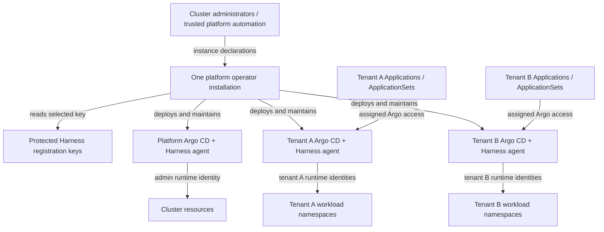

# Operator-managed GitOps instances

Status: the two deployment patterns below reflect the requested product
direction. API shapes and implementation choices are proposals, not released
features. No Go or Helm behavior has changed.
Updated: 2026-09-06. Source baseline: operator commit `a866df5`, controller chart
`0.8.0`, application version `v0.5.0`.

## Product direction

Pattern 1 is the first implementation target: one platform-owned operator
installation provisions and manages the platform and tenant GitOps instances.
Tenants are consumers of Argo CD. They submit Applications, ApplicationSets,
and application code; they do not access the operator or author its management
resources. One installation can have HA replicas with one elected leader.

Pattern 2 is an exception for a Harness organization administrator who needs
an independent operator to provision instances within that organization's
delegated scope. It is secondary work, not the default deployment for tenants.

The operator product includes runtime deployment and lifecycle management.
Its internal registration, runtime, and mapping responsibilities remain
separate reconcilers/modules within the same operator. They are not separate
operator installations.

The primary scope is this repository's Go code and Helm charts. Hub inventory,
IDP workflows, Terraform, and unrelated addons remain downstream integrations.
This document replaces the earlier recommendation of a dedicated operator for
each tenant.

## Pattern 1: one platform operator, many GitOps instances

Cluster administrators install the operator and supply approved Harness
credentials in a protected namespace such as `hga-system`. Administrators or
trusted platform automation declare each desired instance. The operator
registers its agent, deploys Argo CD and the Harness agent runtime, establishes
its access boundaries, configures project mappings, and maintains its lifecycle.

The platform's administrative Argo instance may manage the whole cluster.
Tenant instances get separate namespaces, runtime ServiceAccounts, and
workload grants confined to their allocated namespaces. Tenant Argo access
does not grant namespace-admin rights over the instance's Kubernetes objects.



There is no tenant-to-operator management path. A future IDP request can be
validated and approved by platform automation, which then authors the management
resource using its own identity. The operator must not treat tenant application
repositories as trusted instance declarations.

### Actors and access

| Actor/component | Can manage | Must not gain through tenant input |
|---|---|---|
| Cluster administrator | Operator installation, instance declarations, namespace assignments, credentials, shared CRDs | No tenant isolation from the cluster administrator is claimed |
| Platform operator | Declared agent registrations, runtime releases, instance configuration, delegated RBAC, token Secrets and mappings | Arbitrary instructions from a tenant's workload manifests |
| Platform admin Argo instance | Administrative cluster resources, as intentionally authorized | Untrusted tenant write access to the platform instance or its source repository |
| Tenant/developer | Permitted Applications/ApplicationSets and application delivery through its assigned Argo instance | Operator CRs, platform keys, instance security configuration or another tenant's Argo instance |
| Tenant Argo application-controller | Required Argo internals and approved workload kinds in assigned namespaces | HGA management CRs, its own security boundary, cluster-scoped workloads or foreign namespaces |
| Tenant ApplicationSet controller | Permitted generation of Applications in its own instance | Foreign credentials, unrestricted projects, operator management or arbitrary namespace access |
| Tenant Harness agent | Required integration, logs and approved resource actions using its own identity | The operator's registration key or Kubernetes identity |

### Kubernetes and Harness authority are independent

Cluster-wide Kubernetes authority is valid for the trusted platform operator
and administrative runtime. Its chart must make that choice explicit.
An account-capable Harness key is valid for platform administration where
its effective grants permit the requested operation.

For tenant-scoped registrations, preserve the earlier requirement to select
an org/project-restricted Harness credential. Platform administrators provision
or reference that credential; tenants need not receive it or submit it to the
operator. There may be several protected keys, selected by platform-owned
instance configuration. Each instance namespace holds its own scoped
registration key beside the Agent CR, and the controller reads keys only from
namespaces the platform has approved; the generated agent token is written to
the same namespace.

| Instance type | Kubernetes runtime authority | Harness scope |
|---|---|---|
| Platform administrative instance | Cluster-wide access permitted | ACCOUNT, ORG or PROJECT, according to selected key and declared identity |
| Organization tenant instance | Explicitly assigned workload namespaces | ORG or PROJECT inside its assigned org, where the key permits |
| Project tenant instance | Explicitly assigned workload namespaces | Exact assigned org/project |
| Existing externally managed instance | Preserve existing ownership and authority | Only explicitly authorized observation/mapping; no implicit runtime takeover |

A Harness key does not grant Kubernetes permissions. A CR's `scope: PROJECT`
does not reduce a powerful key's permissions. Keys inherit their principal's
role/resource-group assignments; validate those grants independently of the
operator's desired-scope checks. [Harness service-account documentation](https://developer.harness.io/docs/platform/role-based-access-control/add-and-manage-service-account/).

No implicit switch to a broader key on an authorization failure is allowed.
The same selected credential and declared scope apply to registration, health,
token recovery, mapping operations and cleanup. Do not add IACM permissions or
change CD/IACM role separation; Harness environment access remains controlled
through Resource Groups.

### Tenant Applications and ApplicationSets are a supported use case

Provision an accessible Argo API/UI with the intended authentication and Argo
RBAC. The operator repo's current bootstrap values set `server.replicas: 0`;
that headless default does not satisfy direct tenant Argo access.

Tenants can author their AppSets and push them through a supported submission
path. That capability must be scoped to their instance, assigned projects,
repositories and workload destinations. The platform owns the AppProjects,
default-project restrictions, Argo RBAC, cluster credentials and runtime RBAC.

Define and test both entry paths:

- Argo API/UI submission: enforce the installed Argo version's project and
  ApplicationSet permissions, with application validation/admission as needed.
- Git submission: use a platform-controlled ingestion path that validates and
  applies only permitted Application/ApplicationSet objects into the assigned
  instance. Do not sync arbitrary tenant YAML into an instance namespace with
  a privileged platform identity. Exact ingestion implementation remains a
  design choice; unrestricted app-of-apps is not an isolation mechanism.

Bound project selection, generator overrides, generator Secret references and
destination selection. Keep account-scoped platform keys out of tenant instance namespaces
and avoid a permissive default project. ApplicationSet generation can expose
credentials or select privileged projects, so basic login/RBAC alone is not
the complete boundary. [Argo ApplicationSet security guidance](https://argo-cd.readthedocs.io/en/stable/operator-manual/applicationset/Security/).

Enforce the boundary at the Kubernetes API as well: a tenant's application
controller must not create `HarnessGitopsAgent`, Mapping or Instance resources,
RBAC grants, or other privileged operator requests in workload namespaces.
Use explicit permitted kinds and matching Argo cache settings. Also deny
tenant workload deployment into the Argo control namespace, `hga-system`,
system namespaces and other tenants' namespaces. Restrict the internal Argo
roles separately so they do not reintroduce management access.

These are integration requirements of the operator-deployed instance. Hardening
the operator Deployment alone does not satisfy them. Platform pod-admission
and network controls must also prevent tenant workloads from gaining privileged
host access or an unintended cloud identity.

## The operator now owns the complete instance lifecycle

Keep these responsibilities inside one manager:

| Responsibility | Desired behavior | Current implementation |
|---|---|---|
| Instance orchestration | Validate desired instance, coordinate namespace/policy, registration, runtime and mappings, aggregate readiness | New capability |
| Agent registration | Register/reference Harness agent, maintain provenance and token, observe health, finalize safely | Existing Agent reconciler |
| Runtime deployment | Install, observe, upgrade, repair and remove Argo CD/Harness runtime | New capability; presently installed externally through Helm |
| Instance access configuration | Maintain AppProjects, Argo RBAC/authentication and approved runtime namespace grants | New capability; current bootstrap AppProject uses wildcard permissions |
| Project mappings | One mapping lifecycle per AppProject-to-Harness target | Existing Mapping reconciler |
| Operational behavior | Per-instance conditions, retries, drift checks, rotation and cleanup | Extend existing conditions, ownership and retry behavior |

Current controller RBAC covers Secrets, HGA CRs and AppProject reads. It does
not grant the Deployment/StatefulSet/Service/configuration/RBAC writes needed
for runtime provisioning. Extending the operator therefore requires coordinated
code and chart work. A deliberate cluster-admin installation is valid for
Pattern 1; a narrower role must include all intended operations and satisfy
Kubernetes privilege-escalation checks when granting runtime Roles.

This is separation of concerns within the product: the operator is responsible
for deploying agents even if it uses a Helm library and separate reconcilers
to implement that responsibility.

## Proposed instance API and ownership

Recommend adding a platform-facing `HarnessGitopsInstance` orchestration
resource while retaining `HarnessGitopsAgent` and
`HarnessGitopsProjectMapping` as lifecycle resources. An alternative is to
extend the Agent CR with runtime fields, but that combines registration-only
and full-instance behavior in one API and complicates existing-agent semantics.
The new orchestration resource is a proposal; the deployment topology is settled.

Illustrative future API, not a manifest accepted by the current CRDs:

```yaml
apiVersion: infrastructure.kandylis.co.uk/v1alpha1
kind: HarnessGitopsInstance
metadata:
  name: payments-checkout
  namespace: hga-system
spec:
  profile: tenant
  instanceNamespace: payments-gitops
  credentialRef:
    name: payments-checkout-api-key
  harness:
    accountId: example_account
    scope: PROJECT
    orgId: payments
    projectId: checkout
    agentIdentifier: payments_checkout
  workloadNamespaces:
    - payments-dev
    - payments-prod
  runtime:
    mode: Managed
    releaseProfileRef: tenant-standard
  argo:
    projectName: checkout
    accessProfileRef: payments-developers
    sourceRepos:
      - https://github.com/example/payments-apps.git
  projectMappings:
    - name: checkout
      appProject: checkout
      autoCreateServiceEnv: false
  deletionPolicy: RetainWorkloads
```

The referenced release/access profiles are protected platform configuration;
their eventual storage and schema are not yet selected. They resolve a pinned,
tested runtime package and authentication policy. Arbitrary charts, images,
plugins or Helm values from tenant application repositories must not execute
with operator authority.

Keep Instance CRs and registration credentials protected. Place child Agent
and Mapping CRs with the AppProject and runtime token in the instance namespace,
preserving the current same-namespace reference contracts. Deny tenant and
tenant runtime access to those management CRs.

A parent in `hga-system` cannot use a namespaced owner reference to garbage
collect children in `payments-gitops`. Persist a durable inventory of managed
objects/releases and their UIDs, verify provenance before changes, and use
explicit finalization across namespaces. Use normal owner references only
where their scope is valid. [Kubernetes ownership rules](https://kubernetes.io/docs/concepts/overview/working-with-objects/owners-dependents/).

Do not give two reconcilers or Helm releases ownership of the same fields.
The Instance reconciler owns its desired child specs, while the Agent/Mapping
reconcilers own their status, remote resources and existing finalizers. Use a
runtime package that does not also render those child CRs or duplicate the
operator-managed AppProjects and grants.

## Runtime deployment approach

The operator must perform runtime deployment in Pattern 1. The implementation
choice is how it materializes and maintains that runtime:

| Approach | Fit | Main consequence |
|---|---|---|
| Helm SDK with a controlled runtime chart | Recommended first candidate given the existing Helm integration | Reuses chart behavior, but needs release recovery, serialization, drift and deletion handling |
| Typed Kubernetes resources / server-side apply | Viable alternative | Precise ownership, with more upstream Argo/runtime manifests to maintain |
| Create an Argo Application and rely on another Argo instance | Possible downstream integration | Adds a prerequisite/circular bootstrap dependency; not the primary provisioning mechanism |

The [Helm Go SDK](https://helm.sh/docs/sdk/) provides installation and release
operations. Pin its version and the runtime chart/image combination after a
compatibility spike. Bundle or verify the approved package and lock dependency
resolution. Do not fetch a mutable latest chart on each reconciliation or run
a shell command assembled from user-controlled values.

The current bootstrap chart combines CRs with the runtime. Extract or provide
a runtime-only package and a compatibility path for existing bootstrap users.
The controller chart installs the operator and shared CRDs; instance declarations
cause that operator to create each runtime release. Tenant workload repos must
not also manage the operator-owned release.

For a fresh cluster, make shared Argo CRD installation an explicit optional
part of the platform installation workflow. Reuse an existing CRD owner where
one is already present. Per-instance runtime releases disable CRD installation
and verify the required served versions. This avoids both an undeclared manual
prerequisite and competing CRD owners on the second instance.

Define release identity from the instance identity and namespace. Serialize
operations per release, persist intended/observed revisions, and recover from
a manager crash or an interrupted Helm operation. Bound SDK calls so one
install cannot indefinitely block other instances. A periodic Helm upgrade
alone is not a complete drift strategy: observe the managed runtime resources,
detect missing/changed objects, and reconcile only fields/releases the operator
owns. Do not continuously create release revisions for an unchanged desired
state or repeatedly retry a known-bad upgrade without backoff.

Pass Secret references into runtime values, not registration API keys. Helm
release storage must not become another copy of the platform credentials.

## Provisioning, upgrades and removal

Provisioning is an asynchronous sequence with durable status:

1. Validate the Instance, credential reference, Harness target, namespace
   allocation, release profile and ownership. Install shared HGA/Argo CRDs
   through the administrator-owned prerequisite path.
2. Prepare the instance namespace and security configuration. Require approved
   workload namespaces to exist for the first version; namespace creation can
   be a separate platform action. Establish runtime grants and AppProjects
   before exposing tenant access.
3. Reconcile the Agent registration and obtain its owned token Secret.
4. Install the Argo CD and Harness agent runtime using that token reference.
5. Observe Kubernetes rollout readiness, the tenant Argo access configuration,
   and Harness connection/health.
6. Reconcile and verify requested project mappings.
7. Report Instance Ready only when required components reflect the current
   generation and all required health checks pass.

Do not wait for Harness Connected/Healthy before deploying the runtime that
establishes the connection. Registration/token readiness and runtime health
are separate gates. Report conditions such as `Registered`, `RuntimeReady`,
`AccessConfigured`, `MappingsReady` and aggregate `Ready`, with actionable
reasons and observed generation. Exact names are proposed.

Upgrades change an explicit desired runtime version/profile revision. Preserve
agent identity and existing ownership. Validate compatibility, roll out,
observe readiness, and report failed versus last-successful revisions.
Choose an explicit bounded rollback policy; avoid an endless upgrade/rollback
loop. The instance must not upgrade or uninstall the shared operator or CRDs.
Token replacement must trigger whatever runtime reload/restart the pinned
runtime actually requires.

For removal, default to retaining tenant workloads. Stop new submissions,
resolve the retention/handover of Application/ApplicationSet objects while the
Argo controllers still run, finalize mappings, and finalize the managed Harness
agent before removing its runtime. Keep the operator and selected credential
available until remote cleanup finishes. Uninstall only verified owned runtime
resources and remove only the instance's grants.

Do not automatically delete workload namespaces or data. Do not automatically
delete the instance namespace while Application finalizers or retained objects
remain. Explicit workload destruction requires a separately defined policy and
authorization; force-removing finalizers is not normal cleanup. Preserve the
existing no-delete/no-token-generation behavior for external agents and never
take over an existing Helm release or Argo instance without an explicit,
verified adoption workflow.

## Helm product boundary and current gaps

| Artifact | Target responsibility |
|---|---|
| Controller chart | Install one operator, explicit administrative RBAC, protected settings, health/metrics, optional shared CRDs and HA configuration |
| Runtime-only chart/package | Materialize a tested Argo CD/Harness runtime with operator-derived configuration |
| Instance examples | Platform-authored declarations for admin, org-tenant and project-tenant instances |
| Existing bootstrap chart | Compatibility/manual installation path with explicit migration of release ownership |

Immediate gaps in this repository:

- No Instance orchestration or runtime release management exists in Go.
- Controller RBAC does not cover runtime installation or delegated grant management.
- Bootstrap AppProject rules are currently hardcoded wildcards; tenant policy
  must become explicit and derived from the instance contract.
- Bootstrap defaults disable the Argo server; direct tenant consumption needs
  a supported UI/API/authentication profile.
- Runtime chart and child CR ownership are currently combined.
- Readiness does not yet aggregate a complete operator-managed instance.
- ApplicationSet submission, access revocation, runtime drift/upgrade, and
  workload-preserving deletion need end-to-end tests.

## Pattern 2: organization administrator's operator (exception)

A Harness org administrator may operate a separate installation to provision
their own GitOps instances. Ordinary developers still consume those instances;
they do not become operator administrators.

This installation uses an org-restricted key and Kubernetes grants for only
the namespaces delegated by cluster administrators. It may create ORG agents
and PROJECT agents/mappings inside its allowed org where authorized. A Harness
org-admin role does not itself grant Kubernetes access. Cluster administrators
install shared CRDs and pre-provision namespaces/grants; the org operator cannot
grant itself cluster authority or install arbitrary cluster-scoped resources.

Reuse the instance lifecycle and runtime package from Pattern 1. Add scoped
watches, scoped uncached/dynamic reads, namespace Roles, org target validation,
and an independent leader-election identity for the org installation. Since it
deploys runtimes, these Roles must cover the intended runtime objects and the
permitted grant-management operations, not only HGA CRs and Secrets.

If both installations run in one cluster, explicitly assign instances/namespaces
and remote agents to one owner. The platform operator must not also reconcile
the org operator's children or releases. The current cluster-wide mapping claim
scan needs redesign before a restricted org installation can operate without
cluster-wide reads; preserve provenance and exclusive remote ownership when
doing so. Independent leaders or namespace labels alone do not coordinate
ownership. Enforce reservations/adoption rules before supporting overlapping
remote domains. The same remote resource managed from multiple Kubernetes
clusters remains outside the first supported topology.

This work follows a functioning Pattern 1. It must not drive the first version
toward an operator per tenant.

## Delivery sequence and acceptance criteria

| Stage | Work in this repository | Required evidence |
|---|---|---|
| 1. Instance contract | Define platform-authored Instance API, profiles, credentials, child ownership and lifecycle | Clear admin/tenant instance examples; existing Agent/Mapping semantics preserved |
| 2. Runtime provisioning | Add orchestration/runtime modules to the same manager; runtime-only package; controller chart RBAC/settings | One operator provisions platform and tenant instances on a fresh cluster without a separate per-instance Helm deployment step |
| 3. Tenant consumption | Restricted AppProjects/runtime RBAC, Argo UI/API/authentication, constrained AppSet submission | Tenant successfully delivers apps and is denied operator/control-plane/foreign-namespace access |
| 4. Lifecycle reliability | Drift, upgrades, rotation, aggregate status, failover and retention-aware cleanup | Crash/retry/upgrade/deletion scenarios pass without duplicate ownership or workload loss |
| 5. Publish Pattern 1 | Tested image/chart/runtime version matrix, packaging and operational guidance | Reproducible install and migration; no competing Helm/GitOps owner |
| 6. Org exception | Delegated namespace/RBAC mode and ownership coordination | Org admin provisions instances within org/namespace bounds; platform and org operators coexist safely |

Required Pattern 1 acceptance scenarios:

| Scenario | Expected result |
|---|---|
| Admin declares a platform instance | Operator registers and deploys it with deliberately authorized cluster access |
| Admin declares two tenant instances | Same operator deploys both; each uses its selected scoped credential and isolated runtime identities |
| Developer submits an allowed ApplicationSet via Argo or Git | Applications deploy successfully into that tenant's permitted namespaces |
| AppSet chooses another project, namespace, credential or unsafe generator | Submission/generation is rejected or confined; no broader deployment or credential access |
| Tenant manifest includes an HGA management CR, RoleBinding or control-plane change | Denied through both supported submission paths; operator performs no requested side effect |
| Tenant attempts to read the registration key | Denied; only the runtime receives its required agent token |
| Agent token exists but runtime is not connected | Runtime deployment proceeds; readiness remains pending |
| Key denies a requested Harness operation | Clear failure condition; no platform-key fallback |
| Operator restarts during registration or runtime installation | Recovers recorded intent without duplicate remote ownership or competing releases |
| One runtime install fails | Other instances continue reconciling with bounded retries and independent status |
| Runtime object is deleted or changed out of band | Operator restores its desired owned runtime state without overwriting tenant Applications |
| Runtime version is upgraded or token rotated | Rollout and health are verified; registration identity is preserved |
| Instance is removed with retained workloads | Remote cleanup and runtime/grant removal complete; user workloads/data survive |
| Existing runtime is encountered | Report ownership conflict or require explicit adoption; no silent takeover |

Use unit tests for lifecycle/policy, API-server tests for RBAC and ownership,
chart render tests for installation/runtime profiles, and real Harness
integration tests using appropriately scoped service accounts. Confirm actual
endpoint permissions for org/project keys. No production readiness percentage
is assigned to features that exist only in this proposal.

## Remaining implementation decisions

Pattern 1 and the limited Pattern 2 are the chosen direction. The remaining
questions concern implementation details:

1. Final Instance API shape and whether to introduce the proposed orchestration CR.
2. Helm SDK versus direct resource reconciliation, selected through a runtime
   lifecycle/recovery spike.
3. Authentication/access profiles and the constrained Git-to-ApplicationSet
   submission mechanism for the pinned Argo version.
4. Explicit adoption/migration and deletion contracts for existing instances.

Work starts with the single platform operator deploying complete instances.
Org-owned operators are a later, exceptional deployment of that same product.
